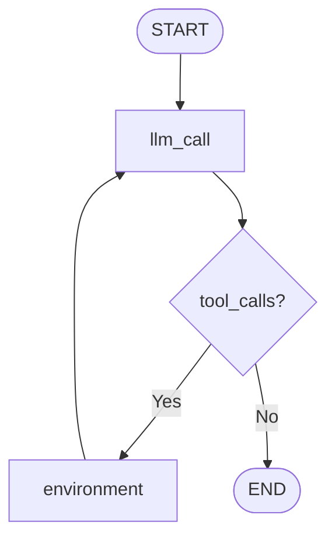

# LangGraph Simple Agent Loop

This example demonstrates the fundamental agent pattern in LangGraph: an agent that **plans, acts, observes, and loops** until the task is complete. This is the core pattern for building autonomous agents that can reason through multi-step problems.

## Key Concept: The Agent Loop

```
START → llm_call → [tool_calls?] → environment → llm_call → [no tools?] → END
         ↑                           ↓
         ←←←←←←← (loop back) ←←←←←←←
```

## The Pattern

### 1. **Plan**: LLM analyzes the problem and decides what to do
- Receives user query and conversation history
- Reasons about what tools (if any) are needed
- Makes tool calls or provides final answer

### 2. **Act**: Environment executes the chosen tools
- Tool calls are executed with provided arguments
- Results are returned as observations

### 3. **Observe**: LLM receives feedback from the environment
- Tool results become part of the conversation
- LLM can see what happened and plan next steps

### 4. **Loop or Exit**: Decide whether to continue
- **Continue**: If more work needed → Loop back to planning
- **Exit**: If task complete → END

## Setup

1. **Install Dependencies**
   ```bash
   # From the project root
   pip install -r requirements.txt
   ```

2. **Configure Environment**
   ```bash
   cd examples/langgraph/03_simple_agent_loop
   cp .env.example .env
   ```

3. **Set API Key (Optional)**
   - For OpenRouter: Get your API key from [OpenRouter](https://openrouter.ai/keys)
   - Edit `.env` and set your `OPENROUTER_API_KEY`
   - If no API key is provided, it will fall back to local Ollama

## Running the Example

```bash
cd examples/langgraph/03_simple_agent_loop
python main.py
```

## Example Output

### Simple Case: "Add 3 and 4"
```
🚀 AGENT EXECUTION
Query: Add 3 and 4
================================

STEP 1
============================================================

🔵 Node: llm_call
🤖 AI Message with Tool Calls:
   Tool: add
   Args: {'a': 3, 'b': 4}
   ID: call_abc123

STEP 2
============================================================

🔵 Node: environment
🛠️  Tool Result:
   Tool: add
   Result: 7

STEP 3
============================================================

🔵 Node: llm_call
💬 AI Response:
   The sum of 3 and 4 is 7.

✅ EXECUTION COMPLETE
```

### Multi-Step Case: "Add 3 and 4. Then multiply by 4."
```
🚀 AGENT EXECUTION
Query: Add 3 and 4. Then, take the output and multiply by 4.
================================

STEP 1
============================================================

🔵 Node: llm_call
🤖 AI Message with Tool Calls:
   Tool: add
   Args: {'a': 3, 'b': 4}
   ID: call_def456

STEP 2
============================================================

🔵 Node: environment
🛠️  Tool Result:
   Tool: add
   Result: 7

STEP 3
============================================================

🔵 Node: llm_call
🤖 AI Message with Tool Calls:
   Tool: multiply
   Args: {'a': 7, 'b': 4}
   ID: call_ghi789

STEP 4
============================================================

🔵 Node: environment
🛠️  Tool Result:
   Tool: multiply
   Result: 28

STEP 5
============================================================

🔵 Node: llm_call
💬 AI Response:
   I've completed the calculation:
   1. First, I added 3 and 4 to get 7
   2. Then, I multiplied 7 by 4 to get 28
   
   The final result is 28.

✅ EXECUTION COMPLETE
```

## Understanding the Loop Mechanics

### 1. **Entry Point**: `START → llm_call`
- Every agent execution begins at the `llm_call` node
- LLM receives the user query and any conversation history

### 2. **Decision Point**: `should_continue()`
The conditional edge function determines the flow:

```python
def should_continue(state: MessagesState) -> Literal["environment", END]:
    messages = state["messages"]
    last_message = messages[-1]
    
    # If the LLM makes a tool call, continue to environment
    if last_message.tool_calls:
        return "environment"
    
    # If no tool calls, we're done
    return END
```

### 3. **Action Execution**: `environment` node
- Executes all tool calls from the LLM
- Returns observations as `ToolMessage` objects
- Automatically loops back to `llm_call`

### 4. **State Accumulation**
Each iteration adds to the conversation:
- **User message**: Original query
- **AI message**: LLM response with tool calls
- **Tool messages**: Results from tool execution
- **AI message**: LLM analysis of results
- **Repeat** until no more tool calls needed

## Exit Strategy

### **Natural Termination**
The agent stops when the LLM decides no more tools are needed:
- LLM analyzes the current state
- Determines if the problem is solved
- Provides final answer without tool calls
- Loop terminates naturally

### **Why This Works**
- **Self-directed**: Agent decides when it's done
- **Flexible**: Can handle varying complexity
- **Safe**: No infinite loops (LLM naturally concludes)
- **Contextual**: Each decision considers full conversation

## Available Tools

| Tool | Description | Arguments | Example |
|------|-------------|-----------|---------|
| `add` | Addition | `a: int, b: int` | `add(3, 4)` → `7` |
| `subtract` | Subtraction | `a: int, b: int` | `subtract(10, 3)` → `7` |
| `multiply` | Multiplication | `a: int, b: int` | `multiply(6, 7)` → `42` |
| `divide` | Division | `a: int, b: int` | `divide(15, 3)` → `5.0` |

## Test Cases Included

1. **Simple**: "Add 3 and 4"
   - Single tool call, immediate result

2. **Sequential**: "Add 3 and 4. Then multiply by 4."
   - Two-step process, chained operations

3. **Complex**: "Calculate (15 + 25) divided by 2, then multiply by 3"
   - Multi-step with intermediate calculations

4. **Chain**: "Start with 10, add 5, multiply by 2, then subtract 3"
   - Long sequence of operations

## Key Learning Points

### 1. **Agent Autonomy**
- The agent decides what tools to use and when
- No pre-programmed workflow - pure reasoning

### 2. **Loop Mechanics**
- **Conditional edges** control the flow
- **State accumulation** provides context
- **Natural termination** when task complete

### 3. **Multi-Step Reasoning**
- Agent can break down complex problems
- Each step builds on previous results
- Maintains context throughout execution

### 4. **Flexible Problem Solving**
- Same agent handles varying complexity
- Adapts approach based on the problem
- No need to pre-define steps

## Graph Structure

The compiled graph looks like this:



## Extending the Example

### Add More Tools
```python
@tool
def power(base: int, exponent: int) -> int:
    """Raise base to the power of exponent."""
    return base ** exponent

@tool
def square_root(number: float) -> float:
    """Calculate square root of a number."""
    return number ** 0.5
```

### Add Safety Limits
```python
def should_continue(state: MessagesState) -> Literal["environment", END]:
    messages = state["messages"]
    last_message = messages[-1]
    
    # Safety: Limit maximum iterations
    if len(messages) > 20:  # Prevent infinite loops
        return END
    
    if last_message.tool_calls:
        return "environment"
    return END
```

### Add Error Handling
```python
def tool_node(state: MessagesState):
    result = []
    for tool_call in state["messages"][-1].tool_calls:
        try:
            tool = tools_by_name[tool_call["name"]]
            observation = tool.invoke(tool_call["args"])
            result.append(ToolMessage(content=str(observation), tool_call_id=tool_call["id"]))
        except Exception as e:
            result.append(ToolMessage(content=f"Error: {str(e)}", tool_call_id=tool_call["id"]))
    return {"messages": result}
```

## Comparison with Previous Examples

| Example | Pattern | Exit Strategy | Complexity |
|---------|---------|---------------|------------|
| 01_structured_output | Conditional routing | Immediate after routing | Medium |
| 02_tool_integration | ReAct with tools | No tool calls needed | Medium |
| **03_simple_agent_loop** | **Plan-Act-Observe loop** | **Natural termination** | **Simple but powerful** |

## Next Steps

This foundational pattern can be extended with:
- **Memory systems** for long-term context
- **Planning layers** for complex multi-step tasks
- **Reflection mechanisms** for self-correction
- **Human-in-the-loop** for guidance and oversight
- **Multi-agent coordination** for collaborative problem solving

The simple loop shown here is the building block for all advanced agent patterns in LangGraph.